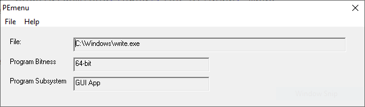
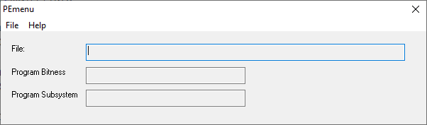

# PEmenu
A GUI version of PEbasic (shows Win32 program type)

Original console version of PEbasic is here:
[https://board.flatassembler.net/topic.php?t=23769](https://board.flatassembler.net/topic.php?t=23769)

Possible analysis after loading a PE file:

1. "32-bit Console App"
2. "32-bit GUI App"
3. "64-bit Console App"
4. "64-bit GUI App"
5. "32-bit PE file"
6. "64-bit PE file"

## New look!

