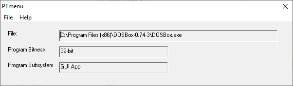
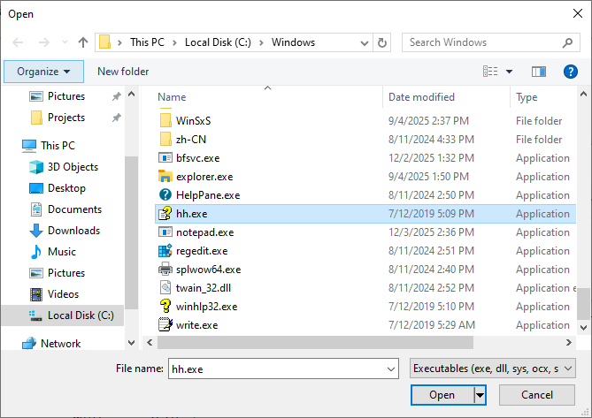

# PEmenu
A GUI version of PEbasic (shows Win32 program type)

Original console version of PEbasic is here:
[https://board.flatassembler.net/topic.php?t=23769](https://board.flatassembler.net/topic.php?t=23769)

## New look!

